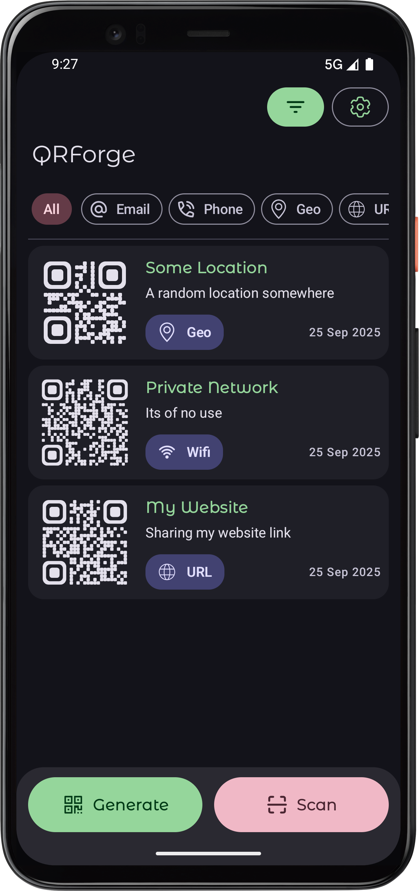
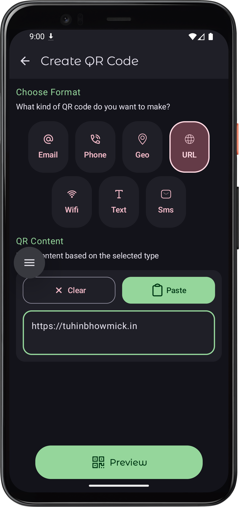
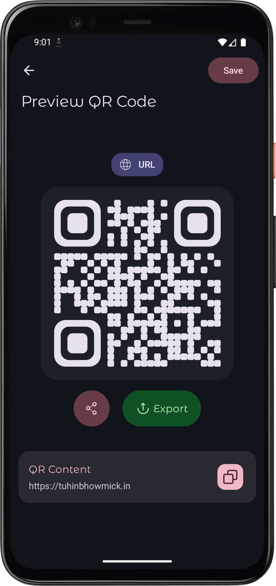
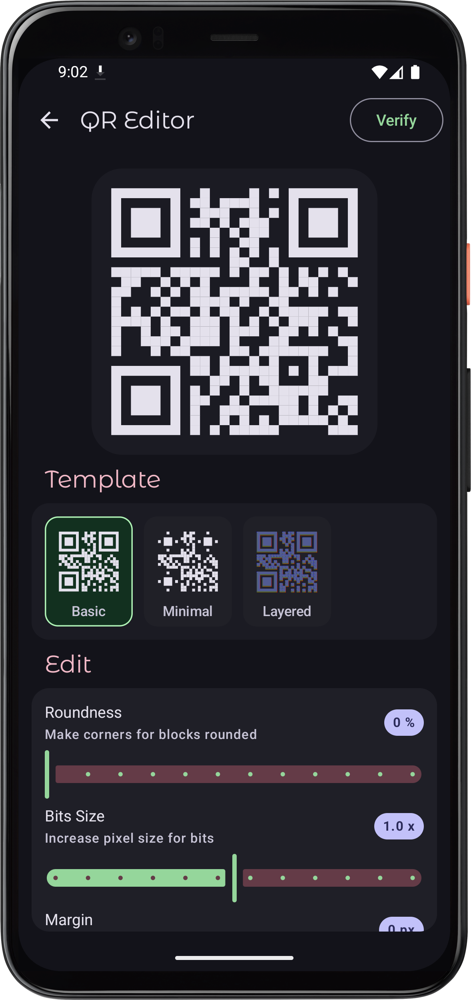
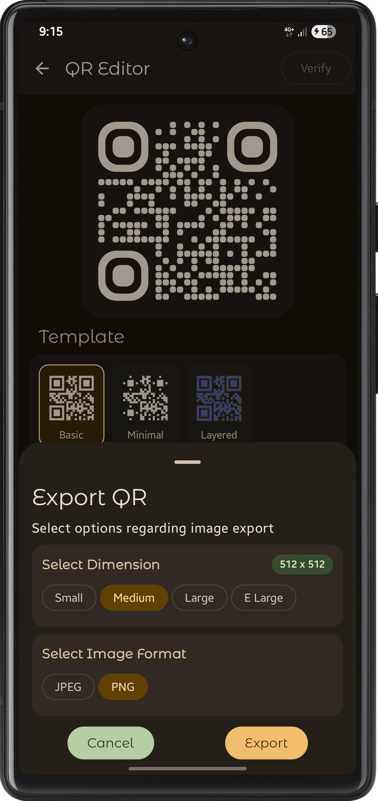
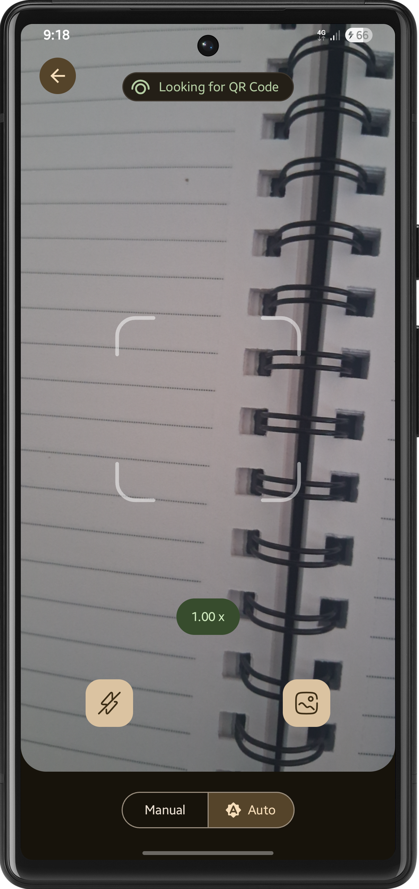
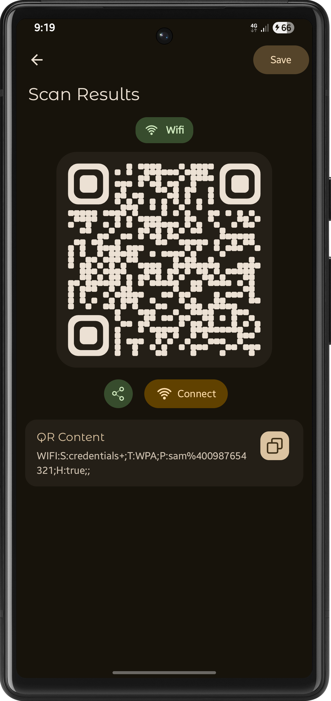

# :purple_square: QR Forge

QRForge a modern android app for generating, customizing, and scanning QR codes with a modern UI
built using Kotlin and Jetpack Compose

## 📖 About

QR Forge is a lightweight, user-friendly Android application that allows you to both **generate**
and **scan** QR codes with ease. Whether you want to share your Wi-Fi credentials, send a quick SMS,
share a location, or simply create a custom QR code design, QR Forge makes it effortless.

Built with **Kotlin** and **Jetpack Compose**, QR Forge combines clean architecture with a smooth
UI, giving you a powerful yet intuitive tool for all your QR needs.

## ✨ Features

- :genie: **Generation** : Create QR codes every type of Qr code for general use
- :paintbrush: **Customization**: Make full customization to your generated code via our editor
- :camera: **QR Code Scanning** :Powered by **Google ML Kit** for accurate and fast scanning.
- :bearded_person: **Share & Save** : Share your scanned or generated code or save it for later use.
- 🎨 **Modern UI** :Built entirely with **Jetpack Compose** for a clean, responsive experience.

## 📸 Screenshots

Here are few screenshots for the app

<p align="center">
   
   
   
   
     
     
   

</p>

### 🔑 Permissions

Here are the list of permission required in this app

- :camera_flash: **Camera** – To scan QR codes.
- :framed_picture: **External Storage** - Save the generated images in the gallery

Optional permissions, but they aren't necessary to the core app functioning

- 📞**Contacts** : To read contacts name from the selected number.
- 🗺️ **Location** : Last Known location for geo based qr code
- :chains: **Wi-Fi State** : To connect to Wi-Fi networks using scanned QR code credentials.

## 🛠️ Tech Stack

- **Language:** Kotlin
- **UI:** Jetpack Compose
- **QR Generation:** ZXing Library
- **QR Scanning:** Google ML Kit
- **Architecture:** Android Jetpack libraries with MVVM and MVI

## :next_track_button: What's next

- [ ] Launching this application to google play store
- [ ] Smoother experience while editing QR before export

## ⚡ Getting Started

1. Clone the repository:

   ```bash
   git clone https://github.com/tuuhin/QRForge
   cd QRForge
   ```

2. Open the project in Android Studio.
3. Make sure the built variant is `ossDebug`. Running `play` flavour is not advisable as it requires
   **google-service.json** to work.
4. Build and run the app on your Android device or emulator.

## 💬 Feedback & Support

If you find a bug or want to provide some feedback you can

- Open an [GitHub Issue](https://github.com/tuuhin/QRForge/issues/new) for bug reports or feature
  requests.

## 🤝 Contribution

We welcome contributions to this QR Scanner/Generator application. If you want to add a new feaure
please add a [GitHub Issue](https://github.com/tuuhin/QRForge/issues/new) first though

1. Fork the repo
2. Create a new branch (`feature/amazing-feature`)
3. Commit your changes
4. Push to your fork and open a Pull Request

## 🎯 Conclusion

**QR Forge** is more than just another QR generator with a **customizable QR designer** made for
convenience, creativity, and everyday use. With its combination of speed, customization, and
modern design, QR Forge makes creating and scanning QR codes effortless
